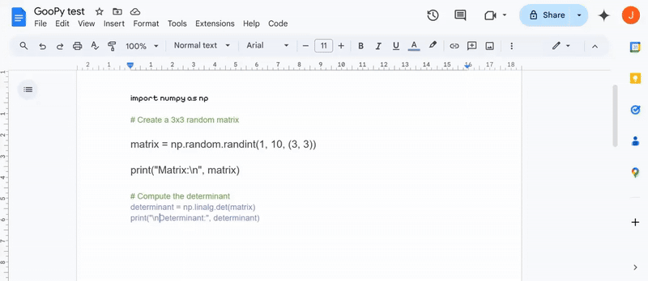

## Introduction

GooPy is a Google Docs add-on that turns your document into a Python IDE.

## Features

Run Code
- Executes the document contents as a Python script

See last output
- Displays the last console output

Manage packages
- List of external Python modules to include in the script (line-separated)
- pip alternative

Manage includes
- List of other documents/scripts to include in the script
- Similar to Python file imports
- Document IDs must be supplied (line-separated)
